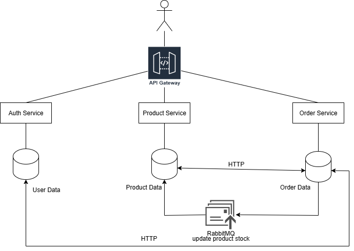

# 🛒 E-commerce Microservices Application

A comprehensive e-commerce platform built with microservices architecture, featuring user authentication, product management, order processing, and real-time inventory management.

---

## Architecture Overview

The system is composed of the following services:

- **API Gateway** (Port 3003) - Central entry point routing requests to appropriate services  
- **Auth Service** (Port 3000) - User management and authentication with Google OAuth  
- **Product Service** (Port 3001) - Product CRUD operations, categories, and color management  
- **Order Service** (Port 3002) - Cart management and order processing with stock updates  
- **Frontend** (Port 5173) - React/Vite web application with TypeScript and Tailwind CSS  

### Supporting Infrastructure

- **MongoDB** - Separate databases for users, products, and orders  
- **RabbitMQ** - Message queue for asynchronous communication between services  
- **Cloudinary** - Image storage and management for product images  

---

## 🚀 Quick Start

### Prerequisites

- Docker & Docker Compose  
- Node.js 18+ (for local development)  
- Kubernetes cluster (for production)  
- Minikube (for local Kubernetes testing)  
- MongoDB & RabbitMQ instances  
- Cloudinary account (for image uploads)  

---

### 🔧 Setup Instructions

### Option 1: Docker Compose (Recommended for Local Development)

1. **Clone the repository**
```bash
git clone https://github.com/DhananjiMadhushika/EC7205-Cloud-Computing-Project.git
cd EC7205-Cloud-Computing-Project
```

2. **Configure environment variables**

Create `.env` files for each service:

**Auth Service (/auth-service/.env)**

```env
MONGO_URI=mongodb://localhost:27017/auth_db
JWT_SECRET=jwt_secret
GOOGLE_CLIENT_ID=google_client_id
GOOGLE_CLIENT_SECRET=google_client_secret
```

**Product Service (/product-service/.env)**

```env
MONGO_URI=mongodb://localhost:27017/product_db
CLOUDINARY_CLOUD_NAME=cloudinary_name
CLOUDINARY_API_KEY=cloudinary_key
CLOUDINARY_API_SECRET=cloudinary_secret
RABBITMQ_URL=amqp://localhost:5672
```

**Order Service (/order-service/.env)**

```env
MONGO_URI=mongodb://localhost:27017/order_db
RABBITMQ_URL=amqp://localhost:5672
```

3. **Start all services**

```bash
docker-compose up --build
```

4. **Access the application**
- Frontend → `http://localhost:5173`
- API Gateway → `http://localhost:3003`
- Auth Service → `http://localhost:3000`
- Product Service → `http://localhost:3001`
- Order Service → `http://localhost:3002`
- RabbitMQ Management → `http://localhost:15672`

### Option 2: Kubernetes Deployment

#### Production Deployment

1. **Create namespace and secrets**
```bash
kubectl apply -f k8s/namespace.yaml
kubectl apply -f k8s/secrets.yaml
kubectl apply -f k8s/configmap.yaml
```

2. **Deploy databases & message queue**
```bash
kubectl apply -f k8s/mongodb/
kubectl apply -f k8s/rabbitmq/
```

3. **Deploy microservices**
```bash
kubectl apply -f k8s/auth/
kubectl apply -f k8s/product/
kubectl apply -f k8s/order/
kubectl apply -f k8s/api-gateway/
kubectl apply -f k8s/client/
```

4. **Get external IPs**
```bash
kubectl get services -n EC7205-Cloud-Computing-Project
```

#### Minikube Testing (Local)

Scripts are included for easier deployment.

**Windows:**
```batch
deploy.bat deploy
deploy.bat status
deploy.bat port-forward
deploy.bat urls
deploy.bat cleanup
```

**Linux/Mac:**
```bash
./deploy.sh deploy
./deploy.sh status
./deploy.sh port-forward
./deploy.sh urls
./deploy.sh cleanup
```

**Access URLs:**
- Frontend: `http://[MINIKUBE_IP]:[FRONTEND_PORT]`
- API Gateway: `http://[MINIKUBE_IP]:[API_GATEWAY_PORT]`
- RabbitMQ Management: `http://[MINIKUBE_IP]:[RABBITMQ_PORT]`

### Option 3: Local Development

1. **Install dependencies for each service**
```bash
# Backend services
cd /api-gateway && npm install
cd ../auth && npm install
cd ../order && npm install
cd ../product && npm install

# Frontend
cd ../../client && npm install
```

2. **Start infrastructure services**
```bash
docker-compose up mongodb rabbitmq
```

2. **Start infrastructure services**
```bash
docker-compose up mongodb rabbitmq
```

3. **Start each service in separate terminals**
```bash
# Terminal 1 - API Gateway
cd /api-gateway && npm run dev

# Terminal 2 - Auth Service  
cd /auth && npm run dev

# Terminal 3 - Product Service
cd /product && npm run dev

# Terminal 4 - Order Service
cd /order && npm run dev

# Terminal 5 - Frontend
cd client && npm run dev
```

## 🏗️ System Architecture & Database Schema


## Testing the Application

### Core Features

1. **User Authentication**
    - Register/Login using Google OAuth
    - JWT authentication for API requests

2. **Product Management**
    - Add/edit/delete products
    - Manage categories & colors
    - Upload product images via Cloudinary
    - order status manage

3. **Cart & Orders**
    - Add products to cart
    - Place orders → stock auto-updates
    - View order history

4. **Inventory Sync**
    - Real-time stock updates using RabbitMQ


## 🚨 Troubleshooting

### Common Issues

1. **Port conflicts**: Ensure 3000–3003, 5173, 27017, 15672 are free
2. **Environment variables**: Verify all required env vars are set correctly
3. **MongoDB connection**: Check MongoDB pods/containers are healthy
4. **RabbitMQ**: Verify credentials & connection string
5. **Cloudinary**: Ensure API credentials are valid
5. **Minikube**: Assign enough resources (4GB RAM minimum)

### Useful Commands
```bash
# Docker logs
docker-compose logs [service]

# Kubernetes logs
kubectl logs -f deployment/[service] -n ecommerce

# Minikube IP
minikube ip

```

### Minikube Troubleshooting
```bash
# Restart Minikube
minikube stop
minikube start

# Check Minikube status
minikube status

# Get Minikube IP
minikube ip

# SSH into Minikube
minikube ssh
```

## 🎯 Quick Start Summary

**For local dev (fastest)::**
```bash
docker-compose up --build
```
- Access → `http://localhost:5173`

**For Kubernetes (prod/minikube):**
```bash
./deploy.sh deploy
minikube tunnel
```

---